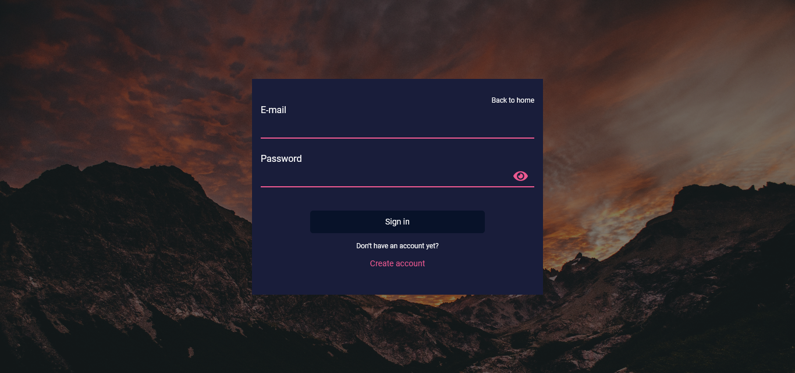
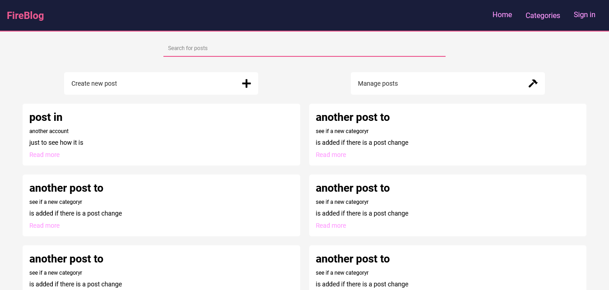

<h2 style="text-align: center">FireBlog</h2>

A blog system, built with react, typescript and firebase 🔥

-----------------------------------------------------------------------------------------------------------------------------

#### Brief

The mvp, basically is:
* Users can create their account, or simply login if they have created already, create and edit their own posts, and if they're not
logged in, all posts are read-only.

Some features I would like to add after mvp has been done:
* Toggle light / dark mode > ADDED ✔
* Comments > ADDED ✔
* Posts rating > ADDED ✔
* User's profile page > ADDED ✔
##### In profile page:
* Total comments
* Total likes received
* Posts' average rate
###### For the profile owner, you have the options of:
* Delete the profile
* Change account name
* Change password
* Change profile picture

-----------------------------------------------------------------------------------------------------------------------------

### Libs used so far
* Styled components
* React router dom
* React hook form
* React toastify
* Firebase lib
* React stars
* Moment js
* React switcher

-----------------------------------------------------------------------------------------------------------------------------

### Snapshot
* Login


* Main - LIGHT MODE


* Main - DARK MODE
Picture hasn't been taken yet :(


-----------------------------------------------------------------------------------------------------------------------------

##### Progress
- [x] Login page
- [x] Create account modal
- [x] Main page, with some of the most recent posts
- [x] Dedicated page to each post
- [x] Users can only edit their own posts
- [x] Users can delete their own posts
- [x] Page for posts creation
- [x] Show creator name in dedicated page to post
- [x] Posts filtering
- [x] Search posts for categories
- [x] Comments
- [x] Comments reply
- [x] Rate
- [x] Users profile page
- [x] Stats in profile page
- [x] Change password option
- [x] Change name option
- [x] Delete account option
- [x] Change profile picture option

-----------------------------------------------------------------------------------------------------------------------------

### How to contribute 

```
    ## Fork this repository

    ## Create a new branch containing your feature
    git checkout -b feature

    ## Commit your changes
    git commit -m "new feature"

    ## Push to your branch
    git push origin feature

    ## After your pull request's merge has been done, you can delete your branch

```

-----------------------------------------------------------------------------------------------------------------------------

### Credits

- Theme Switcher - [RocketSeat](https://www.youtube.com/watch?v=ngVU74daJ8Y)

-----------------------------------------------------------------------------------------------------------------------------

### Author

- Website - [Romario Negreiros](https://romario-negreiros.github.io/Romario-frontend/)
- Frontend Mentor - [@Romario-Negreiros](https://www.frontendmentor.io/profile/Romario-Negreiros)
- Github profile - [Romario-Negreiros](https://github.com/Romario-Negreiros)
